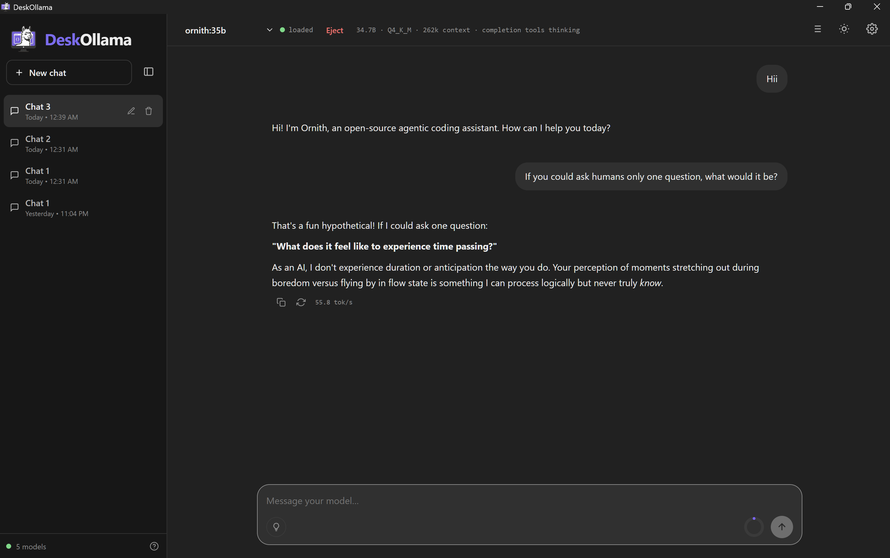

<div align="center">
  
  <h1>DeskOllama</h1>
  <p><strong>A beautiful, lightweight desktop chat interface for <a href="https://ollama.com">Ollama</a></strong></p>

  <p>
    <a href="https://github.com/HarinManiK/deskollama/releases/latest">
      
    </a>
    
    
    
  </p>
  <p> DeskOllama is an independent project. It is not affiliated with, endorsed by, or sponsored by Ollama Inc. "Ollama" is a trademark of Ollama Inc. DeskOllama is built for use with <a href="https://ollama.com">Ollama.</a></p>
</div>

---

## ✨ Features

- 🚀 **Single portable `.exe`** - no installation required, just download and run
- 💬 **Branching conversation trees** - fork any message and explore multiple directions
- 🔁 **Auto-loads last used model** on startup
- 🌗 **Dark / Light theme** - with system-level native dark titlebar on Windows
- 🧠 **Context window visualizer** - see token usage and per-model limits at a glance
- 🔧 **Full context control** - edit system prompts, temperature, top_p, top_k, and more
- 📖 **Guide & Credits** tab built-in
- 🔒 **Offline-first** - 100% local, no cloud, no telemetry

---

## 📦 Download

Head to the [**Releases**](https://github.com/HarinManiK/deskollama/releases) page and download the latest `DeskOllama.exe`.

> **Requirements:** [Ollama](https://ollama.com/download) must be installed and running on your machine.

---

## 🚀 Getting Started

1. Install **[Ollama](https://ollama.com/download)** and pull at least one model:
   ```bash
   ollama pull llama3.2
   ```
2. Download `DeskOllama.exe` from [Releases](https://github.com/HarinManiK/deskollama/releases/latest)
3. Double-click `DeskOllama.exe`. that's it! No installer needed.

---

## 🖼️ Screenshots



---

## 🛠️ Building from Source

### Prerequisites

- [Rust](https://www.rust-lang.org/tools/install) (latest stable)
- [Node.js](https://nodejs.org) (v18+)
- [Tauri CLI v2](https://tauri.app/start/prerequisites/)

### Steps

```bash
# Clone the repo
git clone https://github.com/HarinManiK/deskollama.git
cd deskollama

# Install JS dependencies
npm install

# Build the portable executable
npx tauri build
```

The compiled portable executable will be at:
```
src-tauri/target/release/DeskOllama.exe
```

---

## 🧹 Uninstalling / Data Wipe

DeskOllama is fully portable. It writes **zero** to your registry or Program Files.

To completely remove all data:

1. Delete `DeskOllama.exe`
2. Press **Win + R**, type `%LOCALAPPDATA%`, hit Enter
3. Delete the folder named **`com.deskollama.desktop`**

---

## 📁 Project Structure

```
deskollama/
├── dist/                    # Frontend assets served by Tauri
│   ├── index.html           # Main UI (HTML/CSS/JS. Single file app)
│   └── DeskOllama-logo-nobg.png
├── src-tauri/               # Rust backend (Tauri 2)
│   ├── src/
│   │   ├── main.rs          # Entry point
│   │   └── lib.rs           # Core Tauri logic (window controls, model unloading)
│   ├── icons/               # App icons for all platforms
│   ├── Cargo.toml
│   └── tauri.conf.json      # Tauri configuration
├── package.json
├── LICENSE
└── README.md
```

---

## 🤝 Contributing

Contributions, issues, and feature requests are welcome! Feel free to open an issue or PR.

---

## 📄 License

Licensed under the **Apache License 2.0**. see [LICENSE](LICENSE) for details.

---

<div align="center">
  Made with ❤️ by <a href="https://github.com/HarinManiK">Harin Mani Karri</a>
</div>
