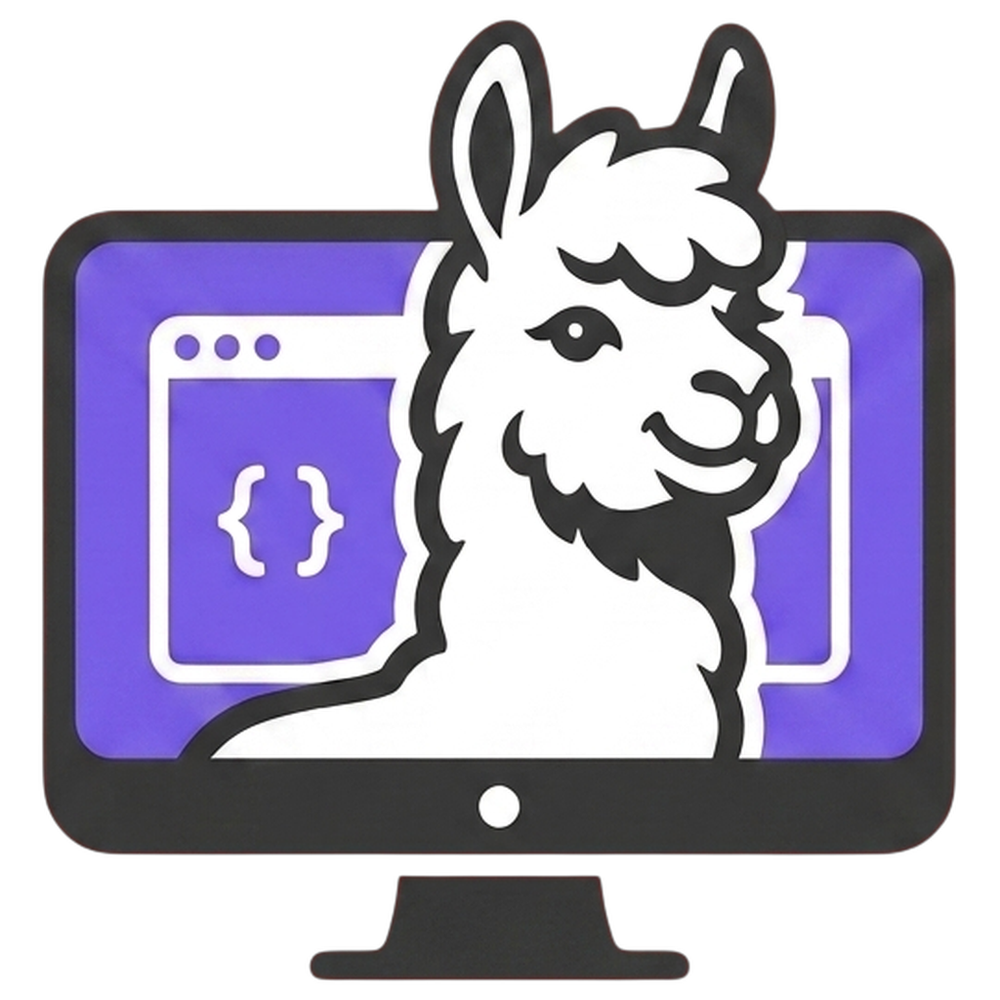

<div align="center">



# DeskOllama

### The Ultra-Fast, Private, Native Desktop Interface for Ollama

[](https://tauri.app)
[](https://www.rust-lang.org)
[](LICENSE)
[](#-getting-started)

*DeskOllama is a high-performance, lightweight, native desktop application for running local LLMs and Multimodal Vision models with zero bloat and complete privacy.*

[**Download Latest Release (Windows .exe / .msi)**](https://github.com/HarinManiK/DeskOllama/releases)

---

</div>

## ✨ Key Features

- **⚡ Instant Boot & Fast Model Switch**: Non-blocking boot (<5ms UI render) with instant model loading & unloading on demand.
- **🖼️ Multimodal Vision Support**: Full support for image inputs on vision-capable models (e.g., Llama 3.2 Vision, Llava, Qwen 2 VL).
- **🔎 Lightbox Image Preview**: Click any attached or thread image to inspect in full resolution with original vs. sent scaling metadata.
- **📁 File & Code Attachments**: Drag and drop or clip text, code, `.json`, `.csv`, `.rs`, `.py` files cleanly formatted into Markdown blocks.
- **📋 Clipboard Screenshot Paste**: Copy any screenshot or image onto your clipboard and press `Ctrl+V` to attach instantly.
- **📊 Real-Time Context Ring**: Live token probe (`measureCtx()`) accurately measures prompt & visual token occupancy on the topbar ring.
- **🎛️ Megapixel Image Budgeting**: Configurable image resolution scaling (`0.3 MP` to `4 MP`, `Original`) with multi-pass anti-aliased canvas halving.
- **💾 Local Storage & IndexedDB**: Persistent conversations, tree-branching replies, and IndexedDB blob storage with automated garbage collection (`attachGC()`).
- **🌙 Native Dark Mode**: DWM Windows dark titlebar (`#212121`) with clean, zero-thrash HSL CSS styling.

---

## 🛠️ Tech Stack & Architecture

- **Frontend**: High-Performance Vanilla JS, CSS3 Design Tokens, HTML5 & IndexedDB.
- **Backend Framework**: [Tauri v2](https://tauri.app) (Rust-powered Desktop Shell).
- **Native OS Layer**: Windows DWM API integration for native dark titlebars and single-instance locks.
- **Local AI Engine**: [Ollama API](https://ollama.com) (`http://localhost:11434`).

---

## 🚀 Getting Started

### Prerequisites

1. **Ollama**: Download and install [Ollama](https://ollama.com) on your computer.
2. **Node.js**: Install Node.js (v18 or newer).
3. **Rust**: Install Rust toolchain via [rustup.rs](https://rustup.rs).

---

### Quick Start (Development)

```bash
# 1. Clone the repository
git clone https://github.com/HarinManiK/DeskOllama.git
cd DeskOllama

# 2. Install dependencies
npm install

# 3. Pull your favorite Ollama model
ollama pull llama3.2

# 4. Run in development mode
npx tauri dev
```

---

### Building for Release

To compile a standalone portable executable (`.exe`) and installer package (`.setup.exe` / `.msi`):

```bash
npx tauri build
```

The compiled binaries will be output to:
- `src-tauri/target/release/DeskOllama.exe` (Portable App)
- `src-tauri/target/release/bundle/nsis/DeskOllama_1.0.0_x64-setup.exe` (Installer)
- `src-tauri/target/release/bundle/msi/DeskOllama_1.0.0_x64_en-US.msi` (MSI Package)

---

## 📁 Repository Structure

```
DeskOllama/
├── assets/                     # Branding logos, screenshots & avatar
│   ├── DeskOllama-logo-nobg.png
│   ├── DeskOllama-logo-text-nobg.png
│   ├── DeskOllama-text-nobg.png
│   ├── DeskOllama-Screenshot.png
│   ├── harin-avatar.jpg
│   └── app-icon.png
├── src/                        # Frontend Web App
│   └── index.html              # The ONE AND ONLY HTML file (UI, CSS & JS)
├── src-tauri/                  # Native Rust Desktop Shell
│   ├── Cargo.toml              # Rust manifest & dependencies
│   ├── Cargo.lock
│   ├── tauri.conf.json         # Tauri window & app configuration
│   ├── build.rs
│   ├── capabilities/           # Tauri v2 security permissions
│   ├── icons/                  # Desktop & mobile app icons
│   └── src/
│       ├── main.rs             # Application entrypoint
│       └── lib.rs              # DWM titlebar & single-instance handler
├── package.json                # Frontend & Tauri scripts
├── package-lock.json
├── README.md                   # Project documentation & guide
└── .gitignore                  # Git exclusions
```

---

## 📄 License

Distributed under the MIT License. See `LICENSE` for more information.

<div align="center">
Built with ❤️ by <strong>HarinManiK</strong>
</div>
